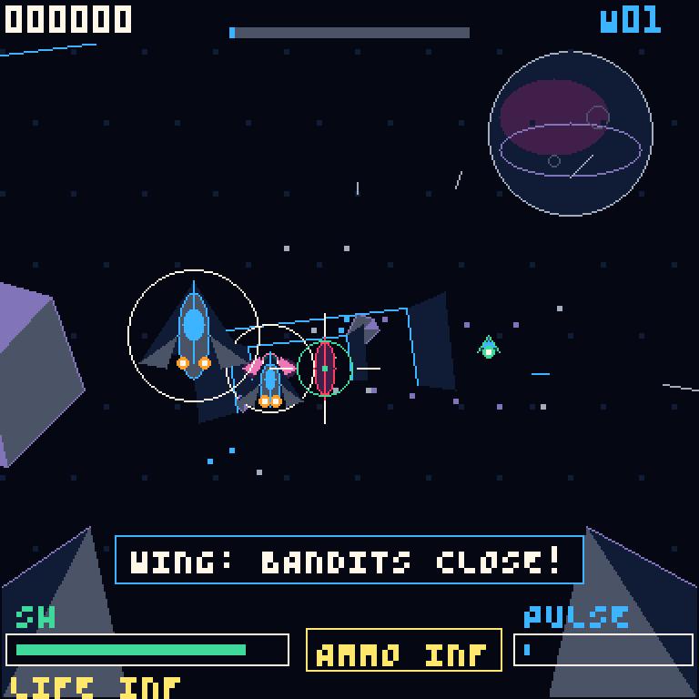

# Fruit Jam Arcade

Native arcade-game firmware and reusable cabinet-I/O foundation for the
[Adafruit Fruit Jam](https://www.adafruit.com/product/6313) RP2350B board.

The first game is **Fruit Jam: Vector Raid**, a fast 128×128 wireframe rail
shooter with DVI video, I2S audio, USB controller support, and physical arcade
I/O hooks.



> **This is not a PICO-8 clone.** Fruit Jam Arcade boots directly into native
> C/C++ game firmware. It has no cartridge loader, Lua runtime, fantasy-console
> REPL, or on-device code editor.

## The goal

This repository is both a playable game and the base for a real, compact arcade
machine. The long-term input platform is intended to support hardware such as:

- a light gun or optical pointing device
- a 3D-printed rifle mounted on pan/tilt rotary encoders
- a physical trigger, reload control, Start, service, and coin inputs
- vibration or recoil feedback so firing feels mechanical
- muzzle lighting, cabinet lighting, and status indicators

Those custom gun and encoder interfaces are a roadmap, not finished hardware
support yet. The current firmware already separates game logic from platform
I/O and provides USB, mouse, gamepad, ADC aiming, and low-voltage feedback hooks
to build on.

## Vector Raid

Vector Raid is a native 60 Hz rail shooter:

- escalating sectors and enemy formations
- five regular enemy classes and an Overseer boss every five waves
- shootable enemy projectiles and telegraphed attacks
- shield damage, three hulls, recovery invulnerability, and pickups
- projection-matched hitboxes and critical core hits
- timed reloads, hit chains, and score multipliers up to ×5
- a screen-clearing Pulse Wave charged through accurate play
- animated tunnel themes, rotating meshes, particles, camera shake, and damage effects
- procedural four-channel title, gameplay, and boss music
- fixed-size gameplay pools with no allocation in the frame loop

## Foundation

| Layer | What it provides |
| --- | --- |
| Game | Native C game state, enemies, scoring, waves, rendering, and procedural audio |
| Graphics | 128×128 4-bit indexed framebuffer, primitives, ASCII HUD text, and RGB565 conversion |
| 3D | Lightweight wireframe meshes, projection, tunnel drawing, and hitbox alignment |
| Video | RP2350 HSTX DVI output |
| Audio | Four-channel synth, I2S PIO, DMA, and Fruit Jam codec setup |
| USB | PIO-USB host with HID, XInput, keyboard, mouse, and controller support |
| Arcade I/O | Trigger feedback, muzzle output, service/start/coin buttons, status LED, and optional ADC aim |
| PSRAM | Optional external-PSRAM initialization plus a TLSF allocation API for future games and assets |
| Host runner | SDL2 build of the same game, graphics, input, and audio code for macOS development |

The USB implementation remains in `usb-host/` and `Pico-PIO-USB/`. It is kept
as a first-class part of the foundation.

## Current controls

### USB controller

- Left stick: aim
- Right trigger or A: fire
- Left trigger or B: reload
- Y: activate Pulse Wave when charged
- Start: start, pause, or resume
- Back/View: toggle the debug overlay

DualSense, DualShock 4, generic HID controllers, and XInput devices have adapter
paths in the firmware. Actual compatibility still depends on the report format
presented by a particular controller or USB adapter.

### Keyboard and mouse

- Mouse: aim
- Left click, Space, or Z: fire
- Right click, R, X, or B: reload
- Q: Pulse Wave
- Return or P: start/pause
- Tab or Backspace: debug overlay
- C: coin input in the host runner
- Arrow keys or WASD: digital aim fallback

## Arcade hardware I/O

| Fruit Jam pin | Direction | Current use |
| --- | --- | --- |
| GPIO6 | output, active high | recoil/feedback pulse on shot |
| GPIO7 | output, active high | muzzle-light/effect pulse on shot |
| GPIO10 | input, pull-up | service button to ground |
| GPIO4 | input, pull-up | Start / onboard Button 2 fallback |
| GPIO5 | input, pull-up | coin / onboard Button 3 fallback |
| GPIO29 | output, inverted | red status LED |
| GPIO40 / ADC0 / A0 | analog input | optional pan aim |
| GPIO41 / ADC1 / A1 | analog input | optional tilt aim |

Enable the experimental analog aiming path at configure time:

```sh
cmake -S . -B build -DENABLE_ADC_AIM=ON
```

The current A0/A1 implementation uses simple calibration constants in
`src/native_io.c`. A future encoder or light-gun implementation should feed the
same normalized aiming boundary rather than putting device-specific logic
inside the game.

### Electrical safety

Fruit Jam GPIO pins must never directly drive a vibration motor, solenoid,
recoil coil, or high-current LED. Use an external power supply and an
appropriately rated MOSFET/driver stage, add flyback protection for inductive
loads, and connect grounds correctly. Validate GPIO6/GPIO7 first with a meter or
small test LED.

## Build the Fruit Jam UF2

Requirements:

- Pico SDK 2.2.0
- ARM GNU toolchain 14.2.1 or newer
- CMake 3.28 or newer
- Ninja or another CMake-supported generator

```sh
cmake -S . -B build -G Ninja
cmake --build build --target fruitjam_railshooter --parallel
```

Firmware output:

```text
build/fruitjam_railshooter.uf2
```

Hold BOOTSEL while connecting the Fruit Jam over USB-C, then copy the UF2 to the
mounted RP2350 drive.

## Run on macOS

The SDL2 host runner uses the same game, renderer, raw-pad state, and graphics
code as the firmware:

```sh
brew install cmake sdl2 pkg-config
./host/run.sh
```

For a deterministic headless gameplay smoke test:

```sh
SDL_VIDEODRIVER=dummy SDL_AUDIODRIVER=dummy \
  ./host/run.sh --demo --fast --frames 7200 --mute \
  --screenshot /tmp/vector-raid.bmp
```

See [host/README.md](host/README.md) for all runner options.

## Optional PSRAM allocator

Vector Raid deliberately uses static pools, but the foundation retains the
Fruit Jam's external PSRAM support for future games, larger asset sets, replay
buffers, and streamed content.

Call `arcade_psram_init()` before using:

- `arcade_psram_alloc()`
- `arcade_psram_alloc_aligned()`
- `arcade_psram_realloc()`
- `arcade_psram_free()`

The public API is in [src/psram_allocator.h](src/psram_allocator.h). It detects
and configures PSRAM through the RP2350 QMI interface, then manages the memory
with the vendored TLSF allocator.

## Repository layout

```text
src/native_game.c       Vector Raid rules and frame loop
src/wire3d.c            Wireframe projection and drawing
src/native_io.c         Cabinet GPIO and optional analog aiming
src/native_pad.c        Raw XInput state boundary
src/native_main.cpp     Fruit Jam startup and USB adapter wiring
src/gfx.c               Indexed framebuffer and drawing primitives
src/audio.c             I2S/DMA synth and codec driver
src/dvi.c               HSTX DVI output
src/psram_allocator.c   Optional external-memory heap
host/                   SDL2 desktop runner
usb-host/               USB host wrappers
Pico-PIO-USB/            PIO USB transport
```

## Releases and branches

The stable arcade foundation lives on `main`. New feature work happens on
`codex/vector-raid-next`.

Tags matching `vector-raid-v*` run the release workflow and build a separately
named UF2 for every branch in [release-branches.txt](release-branches.txt).
Releases also include SHA-256 checksums and exact branch/commit provenance. See
[RELEASING.md](RELEASING.md).

## Origins and licensing

Fruit Jam Arcade began from low-level Fruit Jam hardware bring-up done in the
wili8jam prototype. The cartridge system, Lua runtime, editor, console, SD/FatFS
runtime, and PICO-8 compatibility layer have been removed. The project now
builds only the native arcade firmware.

USB transport and host components retain their own upstream notices. TLSF is
retained under its BSD-style license. The compact font data retains its
yocto-8/MIT origin. See [LICENSE](LICENSE) and the notices in the vendored
directories.
