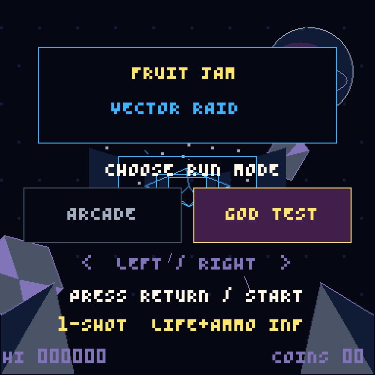
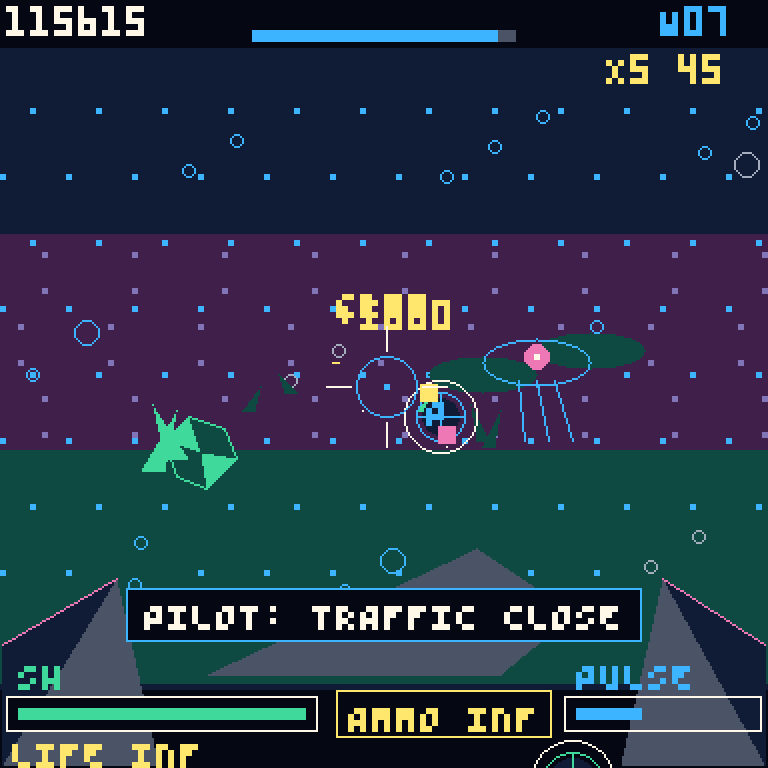
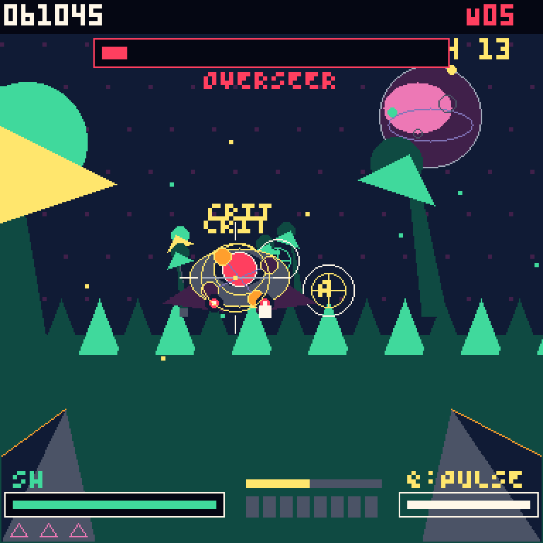

# Fruit Jam Arcade

Native arcade-game firmware and reusable cabinet-I/O foundation for the
[Adafruit Fruit Jam](https://www.adafruit.com/product/6200) RP2350B board.

The first game is **Fruit Jam: Vector Raid**, a fast multi-environment rail
shooter with DVI video, I2S audio, USB controller support, and physical arcade
I/O hooks. Gameplay stays in a stable 128×128 design space while Fruit Jam now
renders it into a true 384×384 framebuffer. Lines, curves, ellipses, filled
surfaces, and silhouettes are rasterized at that full density instead of being
128×128 pixels repeated by the DVI hardware.

| God Test selection | Close dogfight |
| :---: | :---: |
|  |  |
| Abyssal traffic | Overseer battle |
|  |  |

These are deterministic SDL host captures of the shared game renderer at the
Fruit Jam 384×384 render scale, not photographs or DVI captures from a board.

> **This is not a PICO-8 clone.** Fruit Jam Arcade boots directly into native
> C/C++ game firmware. It has no cartridge loader, Lua runtime, fantasy-console
> REPL, or on-device code editor.

## The goal

This repository is both a playable game and the base for a real, compact arcade
machine. The long-term input platform is intended to support hardware such as:

- a light gun or optical pointing device
- a 3D-printed rifle mounted on pan/tilt rotary encoders
- a physical trigger, reload control, Start, service, and coin inputs
- vibration or recoil feedback so firing feels mechanical
- muzzle lighting, cabinet lighting, and status indicators

Those custom gun and encoder interfaces are a roadmap, not finished hardware
support yet. The current firmware already separates game logic from platform
I/O and provides USB, mouse, gamepad, ADC aiming, and low-voltage feedback hooks
to build on.

## Vector Raid

Vector Raid is a native 60 Hz rail shooter:

- escalating sectors and enemy formations
- an automatic ride director with pursuit runs, close dogfights, large flybys,
  banked turns, climbs, dives, occasional evasions, and protected cover beats
- six two-wave location chapters: asteroid chase, mountain run, alien forest,
  underwater abyss, crystal cavern, and orbital ruins
- layered textured backdrops, smooth and angular scenery, foreground vehicle
  framing, chase wingmen, capital ships, creatures, and structures
- seven regular enemy classes with unique multi-part silhouettes and an
  Overseer carrier boss every five waves
- five visually and mechanically distinct shootable attack types: bolts,
  plasma, missiles, lances, and spread shards
- shield damage, three hulls, recovery invulnerability, and pickups
- projection-matched hitboxes and critical core hits
- timed reloads, hit chains, and score multipliers up to ×5
- a screen-clearing Pulse Wave charged through accurate play
- depth-curved routes, rotating meshes, particles, camera shake, and damage effects
- location-specific procedural music with bass, lead, pad, and percussion
- eight-voice stereo synthesis with panning, envelopes, pitch sweeps, and
  layered weapon, impact, pickup, reload, warning, and destruction effects
- selectable **God Test** startup mode with one-shot kills, unlimited ammo, and
  unlimited lives
- fixed-size gameplay pools with no allocation in the frame loop

## Foundation

| Layer | What it provides |
| --- | --- |
| Game | Native C game state, enemies, scoring, waves, rendering, and procedural audio |
| Graphics | 128×128 design coordinates, 384×384 Fruit Jam raster, 4-bit indexed framebuffer, smooth ellipse/circle and sharp polygon primitives, HUD text, and RGB565 conversion |
| 3D | Lightweight wireframe meshes, projection, tunnel drawing, and hitbox alignment |
| Video | RP2350 HSTX DVI output |
| Audio | Eight stereo synth voices, envelopes, pitch slides, I2S PIO, DMA, and Fruit Jam codec setup |
| USB | PIO-USB host with HID, XInput, keyboard, mouse, and controller support |
| Arcade I/O | Trigger feedback, muzzle output, service/start/coin buttons, status LED, and optional ADC aim |
| PSRAM | Optional external-PSRAM initialization plus a TLSF allocation API for future decoded art, sample banks, and replay data |
| Host runner | SDL2 build of the same game, graphics, input, and audio code for Linux and macOS development |

The USB implementation remains in `usb-host/` and `Pico-PIO-USB/`. It is kept
as a first-class part of the foundation.

## Current controls

### Startup mode

On the title screen, use Left/Right or the controller D-pad to choose:

- **Arcade**: standard damage, three hulls, and an eight-shot magazine.
- **God Test**: every direct hit destroys its target, ammo never decreases,
  reload is disabled, and damage can never consume a hull. Score still updates
  for feedback but does not replace the Arcade high score.

Press Return or controller Start to launch the selected mode.

### USB controller

- Left stick: aim
- Right trigger or A: fire
- Left trigger or B: reload
- Y: activate Pulse Wave when charged
- Start: start, pause, or resume
- Back/View: toggle the debug overlay

DualSense, DualShock 4, generic HID controllers, and XInput devices have adapter
paths in the firmware. Actual compatibility still depends on the report format
presented by a particular controller or USB adapter.

### Keyboard and mouse

- Mouse: aim
- Left click, Space, or Z: fire
- Right click, R, X, or B: reload
- Q: Pulse Wave
- Return or P: start/pause
- Tab or Backspace: debug overlay
- C: coin input in the host runner
- Arrow keys or WASD: digital aim fallback

## Arcade hardware I/O

| Fruit Jam pin | Direction | Current use |
| --- | --- | --- |
| GPIO6 | output, active high | recoil/feedback pulse on shot |
| GPIO7 | output, active high | muzzle-light/effect pulse on shot |
| GPIO10 | input, pull-up | service button to ground |
| GPIO4 | input, pull-up | Start / onboard Button 2 fallback |
| GPIO5 | input, pull-up | coin / onboard Button 3 fallback |
| GPIO29 | output, inverted | red status LED |
| GPIO40 / ADC0 / A0 | analog input | optional pan aim |
| GPIO41 / ADC1 / A1 | analog input | optional tilt aim |

Enable the experimental analog aiming path at configure time:

```sh
cmake -S . -B build -DENABLE_ADC_AIM=ON
```

The current A0/A1 implementation uses simple calibration constants in
`src/native_io.c`. A future encoder or light-gun implementation should feed the
same normalized aiming boundary rather than putting device-specific logic
inside the game.

### Electrical safety

Fruit Jam GPIO pins must never directly drive a vibration motor, solenoid,
recoil coil, or high-current LED. Use an external power supply and an
appropriately rated MOSFET/driver stage, add flyback protection for inductive
loads, and connect grounds correctly. Validate GPIO6/GPIO7 first with a meter or
small test LED.

## Build the Fruit Jam UF2

Requirements:

- Pico SDK 2.2.0
- ARM GNU toolchain 14.2.1 or newer
- CMake 3.28 or newer
- Ninja or another CMake-supported generator

```sh
cmake -S . -B build -G Ninja
cmake --build build --target fruitjam_railshooter --parallel
```

Firmware output:

```text
build/fruitjam_railshooter.uf2
```

Hold BOOTSEL while connecting the Fruit Jam over USB-C, then copy the UF2 to the
mounted RP2350 drive.

## Run on macOS or Linux

The SDL2 host runner uses the same game, renderer, raw-pad state, and graphics
code as the firmware. It renders a 256×256 framebuffer by default while aim,
hit testing, and layouts remain in the shared 128×128 design space:

macOS with Homebrew:

```sh
brew install cmake sdl2 pkg-config
```

Ubuntu or Debian Linux:

```sh
sudo apt-get update
sudo apt-get install build-essential cmake libsdl2-dev pkg-config
```

Then build and run on either platform:

```sh
./host/run.sh
```

The host render density is a single CMake setting from 1 through 8. For
example, to test a 384×384 framebuffer without changing gameplay code:

```sh
cmake -S host -B host/build-3x -DGFX_SCALE=3
cmake --build host/build-3x --parallel
./host/build-3x/fruitjam_railshooter_host
```

Fruit Jam firmware uses `GFX_SCALE=3`: a 384×384 indexed render target converted
to a 384×384 RGB565 scanout buffer, centered in 640×480 DVI. The compile-time
guard in `src/dvi.c` keeps the renderer and HSTX DMA dimensions matched.

For a deterministic headless gameplay smoke test:

```sh
SDL_VIDEODRIVER=dummy SDL_AUDIODRIVER=dummy \
  ./host/run.sh --demo --fast --frames 7200 --mute \
  --screenshot /tmp/vector-raid.bmp
```

Add `--god` to select God Test automatically for a synthetic demo. Add
`--no-fire` with `--demo` to let enemies approach for visual QA.

The `Linux SDL host` GitHub Actions workflow builds the 384×384 profile on
Ubuntu and runs both the Arcade and God Test 7,200-frame smoke tests on every
push to `main` or a `codex/*` branch.

See [host/README.md](host/README.md) for all runner options.

## Fruit Jam resource profile

The firmware keeps the live video and audio DMA paths in internal SRAM:

- 73,728-byte packed 4-bit 384×384 render target
- 294,912-byte RGB565 DVI scanout buffer
- 20,704-byte HSTX DMA command list
- two 256-frame stereo audio buffers and eight synth voices

The current linked image leaves roughly 86 KiB in the RP2350B main SRAM region,
with the two 4 KiB core stacks in their dedicated scratch banks. HSTX video,
PIO I2S audio, and USB use DMA/PIO so the 252 MHz game core can spend its frame
budget on projection, filled geometry, particles, and indexed-to-RGB conversion.

PSRAM is intentionally not placed in the live HSTX or audio DMA path. The game
is procedural and its fixed pools fit in internal SRAM, so external memory would
add latency without improving this build. The allocator remains ready for a
future decoded sprite atlas, ADPCM sample cache, replay buffer, or larger game.

## Optional PSRAM allocator

Vector Raid deliberately uses static pools and keeps time-critical scanout in
internal SRAM, but the foundation retains the Fruit Jam's external PSRAM
support for future games, larger asset sets, replay buffers, and streamed
content.

Call `arcade_psram_init()` before using:

- `arcade_psram_alloc()`
- `arcade_psram_alloc_aligned()`
- `arcade_psram_realloc()`
- `arcade_psram_free()`

The public API is in [src/psram_allocator.h](src/psram_allocator.h). It detects
and configures PSRAM through the RP2350 QMI interface, then manages the memory
with the vendored TLSF allocator.

## Repository layout

```text
src/native_game.c       Vector Raid rules and frame loop
src/wire3d.c            Wireframe projection and drawing
src/native_io.c         Cabinet GPIO and optional analog aiming
src/native_pad.c        Raw XInput state boundary
src/native_main.cpp     Fruit Jam startup and USB adapter wiring
src/gfx.c               Scalable indexed framebuffer and drawing primitives
src/audio.c             I2S/DMA synth and codec driver
src/dvi.c               HSTX DVI output
src/psram_allocator.c   Optional external-memory heap
host/                   SDL2 desktop runner
usb-host/               USB host wrappers
Pico-PIO-USB/            PIO USB transport
```

## Releases and branches

The stable arcade foundation lives on `main`. New feature work happens on
`codex/vector-raid-next`.

Tags matching `vector-raid-v*` run the release workflow and build a separately
named UF2 for every branch in [release-branches.txt](release-branches.txt).
Releases also include SHA-256 checksums and exact branch/commit provenance. See
[RELEASING.md](RELEASING.md).

## Origins and licensing

Fruit Jam Arcade began from low-level Fruit Jam hardware bring-up done in the
wili8jam prototype. The cartridge system, Lua runtime, editor, console, SD/FatFS
runtime, and PICO-8 compatibility layer have been removed. The project now
builds only the native arcade firmware.

USB transport and host components retain their own upstream notices. TLSF is
retained under its BSD-style license. The compact font data retains its
yocto-8/MIT origin. See [LICENSE](LICENSE) and the notices in the vendored
directories.
